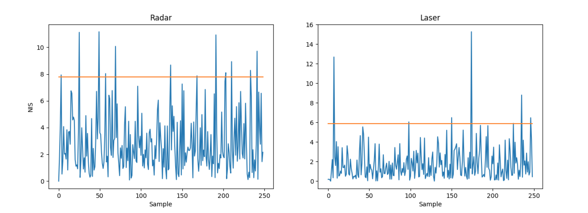

# Unscented Kalman Filter Project 
Self-Driving Car Engineer Nanodegree Program

This project is designed to implement the pipeline for an Unscented Kalman filter using the new concepts introduced in the lesson including the CTRV Model, new prediction of mean squared values using Sigmoid points.  The base project code can be found [here](https://github.com/udacity/CarND-Unscented-Kalman-Filter-Project)

## Basic Build Instructions
(From original project repo)

1. Clone this repo.
2. Make a build directory: `mkdir build && cd build`
3. Compile: `cmake .. && make`
4. Run it: `./UnscentedKF` Previous versions use i/o from text files.  The current state uses i/o
from the simulator.

# Data
The project contains two datasets which contain sensor data for the position and velocity in the x and y directions as well as a timestamp.  The two datasets are mirror images of each other reflected over the y-axis.

# Dataset 1

# Dataset 2

# Visualizing NIS

Radar includes 3 degrees of freedom for a top percentile of 7.8.  Lidar includes 2 degrees of freedom with a top percentile of 5.9

These values are pretty good.  Radar was worse than the laser perhaps because of the additional degree of freedom.

# Rubric
## Compiles
Check

## RMSE <= [0.09, 0.10, 0.40, 0.30]
Dataset 1  RMSE = [0.062, 0.086, 0.327, 0.228]

## Correct Algorithm

Implementation is based on the TODO sections specified in the base project.  

## Code Smell
Smells ok, might be able to smell better but im ok with it.

